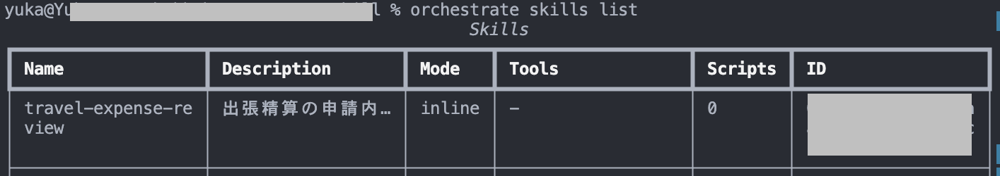
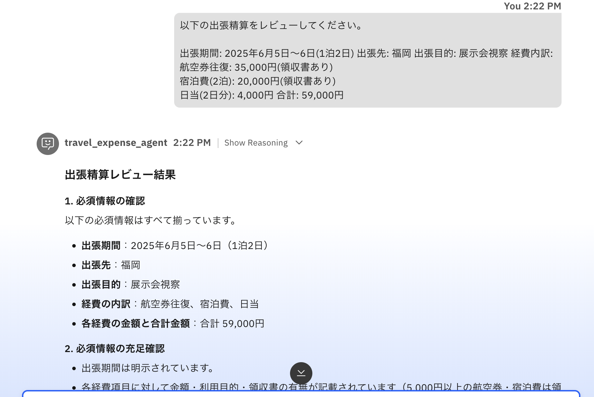
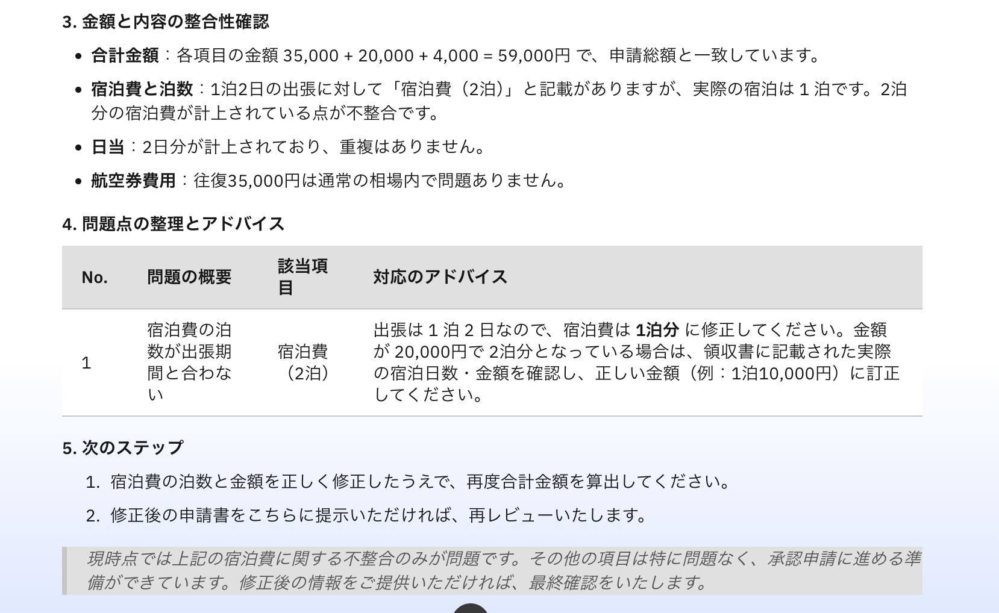
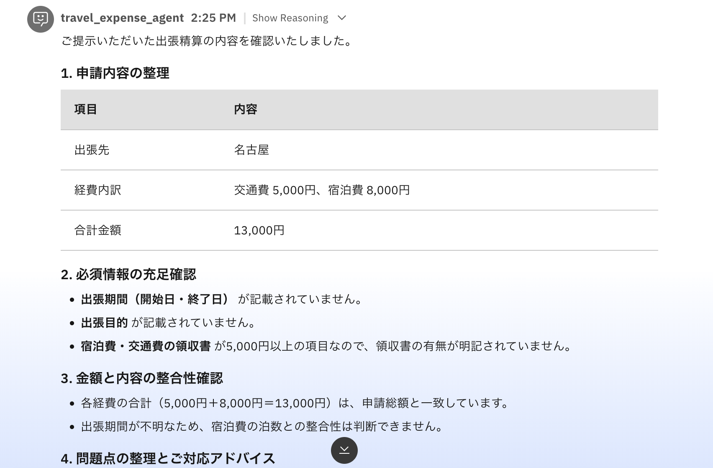
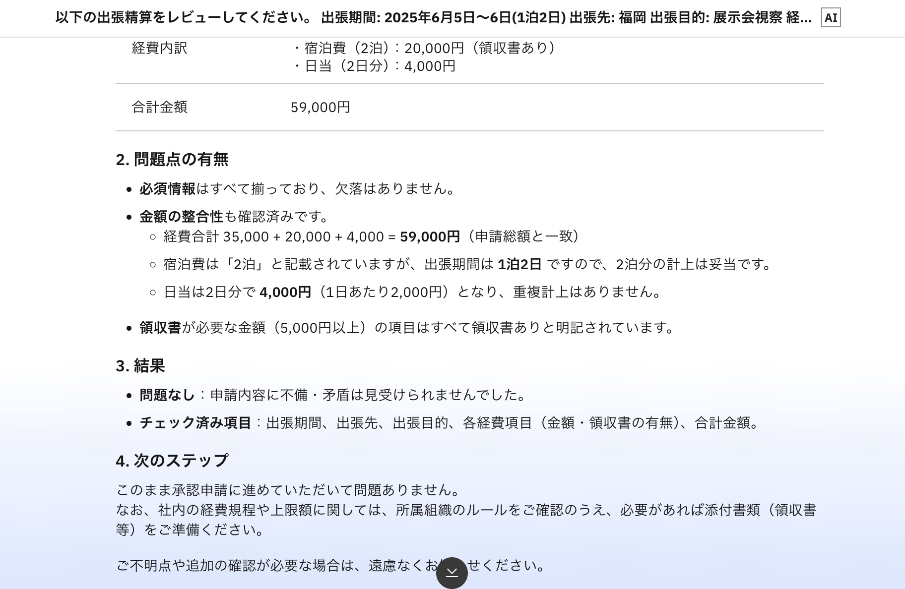

# watsonx Orchestrate の Agent Skills を試してみる

## はじめに

watsonx Orchestrate のエージェントを作るとき、私がやってきた中で一番多いのは「Agentのinstructionにひたすら指示を書く」「Toolを呼び出す指示やガイドラインを書く」という方法です。
シンプルなユースケースならそれで十分です。

ただ、タスクが複数になってきたり、ちょっと専門的な判断が入ってくると「instructionsが長くなってきたな…」「同じ手順を別のエージェントにも持たせたいな…」という場面が出てきます。

そこで今回は、**Agent Skills** という仕組みを使って「出張精算チェックのエージェント」を作ってみました。

## Agent Skills とは

ADK 2.x から使える機能で、エージェントの専門的な手順を `SKILL.md` というファイルとして切り出せます。

公式ドキュメント（[Agent skills overview](https://developer.watson-orchestrate.ibm.com/agent_skills/overview)）に説明があり、ポイントは「**Progressive Disclosure**」という考え方です。

エージェントは最初からすべての Skill の内容を読んでいるわけではなく、

1. まず各 Skill の `name` と `description` だけを見て「どの Skill が関係しそうか」を判断する
2. 関係ある Skill を選んだら、そこで初めて Skill の本文（手順）をコンテキストに読み込む

という流れで動きます。

instructionsに全部書く方式だと、常にすべての手順がコンテキストに入りますが、Skillにしておくと必要な手順だけが読み込まれます。エージェントが複数の専門タスクを持つ場合に特に効いてきます。

### 「Skill」という名前の紛らわしさ

ちょっと脱線しますが、watsonx Orchestrate関連で「Skill」という名前がついたものが2種類あって最初少し混乱しやすいので、整理しておきます。

| | Agent Skills（今回のもの） | Coding Agent Skills（Bob などで使うもの） |
|---|---|---|
| **読み手** | wxo 上で動くエージェント（LLM） | Bob などのコーディングエージェント |
| **タイミング** | ユーザーのリクエストへの応答時 | 開発者がコードを書くとき |
| **目的** | 実行する業務手順の定義 | 開発支援（正確なコード生成） |
| **登録先** | `orchestrate skills import` で wxo 環境に | `.bob/skills/` などコーディングエージェント側 |
| **例** | `travel-expense-review`（今回作ったもの） | `wxo-builder`、`sop-builder`（[ADK リポジトリ](https://github.com/IBM/ibm-watsonx-orchestrate-adk/tree/main/skills)） |

どちらも `SKILL.md` フォーマットを使うので見た目がそっくりなのですが、**読み手と目的が全然違います**。ADKドキュメントの [agents/skills](https://developer.watson-orchestrate.ibm.com/agents/skills) には「`sop-builder` や `wxo-builder` は Agent Skills フォーマットに従った仕様書」と明記されていて、②は①のフォーマットを開発支援ツールとして流用している形です。

この記事では前者の「wxo エージェントが実行時に使う Agent Skills」を扱います。

### Tool / Skill / Workflow の使い分け

整理するとこんな感じです。

| 構成 | 得意なこと | 例 |
|---|---|---|
| Agent + Tool | 単純な実行（API 呼び出し・データ取得） | 顧客検索、チケット作成 |
| Agent + Skill | 専門的な手順・判断を必要とするタスク | 経費チェック、問い合わせ対応 |
| Workflow / Flow | 必ず決まった順序で確実に実行する処理 | 承認フロー、定型業務 |

「手順の順番を LLM に任せてよいか」が分岐点で、ステップが変わると困る処理には Workflow / Flow が向いています。

## 作ったもの

出張精算の申請内容をチェックするエージェントです。

```
agent-skill-tutorial/
├── README.md
├── agent.yaml
└── skills/
    └── travel-expense-review/
        └── SKILL.md
```

ファイルはこれだけです。

## SKILL.md を書く

Skill の実体は `SKILL.md` 1ファイルです。YAML frontmatter と Markdown 本文の 2 構成になっています。

```markdown
---
name: travel-expense-review
description: 出張精算の申請内容をレビューし、必須情報の不足・金額の矛盾・申請内容の不備を確認して結果を報告する。ユーザーが「出張精算をチェックしてほしい」「経費申請を確認してほしい」などと依頼したときに使用する。
---

# 出張精算レビュー手順

## ステップ 1: 申請内容の確認
（以下、手順を自然言語で記述）
```

**frontmatter の `description` がかなり重要です。**

エージェントが「どの Skill を使うか」を判断するのに `name` と `description` しか見ていないので、ここが曖昧だと Skill が選ばれません。「何をする Skill か」だけでなく「どんなリクエストのときに使う Skill か」まで書くのがコツです。

Markdown 本文には実際の手順をそのまま書きます。今回は出張精算のチェック手順を 4 ステップで記述しました。

- ステップ 1: 申請内容の確認（必須情報が揃っているか）
- ステップ 2: 必須情報の充足確認（領収書の有無など）
- ステップ 3: 金額と内容の整合性確認（合計額・泊数のズレなど）
- ステップ 4: 問題点の整理と報告

## agent.yaml を書く

```yaml
spec_version: v1
kind: native
name: travel_expense_agent
description: 出張精算の申請内容をチェックするエージェント。
llm: groq/openai/gpt-oss-120b
style: react_intrinsic
instructions: |
  あなたは出張精算のサポートアシスタントです。
  ユーザーが出張精算の申請内容を提示したら、travel-expense-review スキルを使ってレビューを実施してください。
  日本語で丁寧に回答してください。
skills:
  - travel-expense-review
```
> **注意:** Skill を使う場合は必ずエージェントのstyleとして `react_intrinsic` を指定してください。公式ドキュメントに明記されていますが、`skills:` フィールドは `style: react_intrinsic` のエージェントのみ対応しています。


## import する

まず Skill を登録します。

```bash
orchestrate skills import --dir skills/travel-expense-review/
```

確認します。

```bash
orchestrate skills list
```



次に Agent を登録します。

```bash
orchestrate agents import -f agent.yaml
```


## 動かしてみる

3 パターンで試しました。以下の応答は一部抜粋です。

### パターン A: 問題のない申請

```
以下の出張精算をチェックしてください。

出張期間: 2025年6月10日〜11日（1泊2日）
出張先: 大阪
出張目的: 取引先との打ち合わせ
経費内訳:
  - 新幹線往復: 28,000円（領収書あり）
  - 宿泊費（1泊）: 12,000円（領収書あり）
  - 日当（2日分）: 4,000円
合計: 44,000円
```

| | |
|---|---|
|  |  |

各項目の確認結果を表形式でまとめてくれて、合計額の計算も合っていることを確認した上で「承認申請に進められます」と返ってきました。

### パターン B: 必須情報が不足している申請

出張期間と目的を抜いた状態で投げてみます。

```
出張精算をお願いします。

出張先: 名古屋
経費:
  - 交通費: 5,000円
  - 宿泊費: 8,000円
合計: 13,000円
```



「出張期間」「出張目的」「領収書の有無（宿泊費 8,000円は 5,000円以上）」の 3 点が不足と指摘されました。Skill の手順通りに動いています。

### パターン C: 金額に矛盾がある申請

1泊2日なのに宿泊費を2泊分で申請してみます。

```
以下の出張精算をレビューしてください。

出張期間: 2025年6月5日〜6日（1泊2日）
出張先: 福岡
出張目的: 展示会視察
経費内訳:
  - 航空券往復: 35,000円（領収書あり）
  - 宿泊費（2泊）: 20,000円（領収書あり）
  - 日当（2日分）: 4,000円
合計: 59,000円
```



「1泊2日の出張に宿泊費（2泊）は合致しない。10,000円（1泊分）に修正してください」とピンポイントで指摘されました。

## なぜ instructions に全部書かないのか

この規模なら instructions に全部書いても動きます。実際こういう書き方でも同じことはできます。

```yaml
instructions: |
  あなたは出張精算のサポートアシスタントです。
  出張精算の申請内容が提示されたとき、以下の手順でチェックを行ってください。
  1. 出張期間・出張先・出張目的・経費内訳・合計金額がすべて揃っているか確認する
  2. 各経費項目に日付・金額・目的が記載されているか確認する
  ...（以下、詳細な手順が続く）
```

ではなぜ Skill にするのかというと、エージェントが複数の専門タスクを持ち始めたときに差が出てきます。

- instructions が肥大化すると管理しづらくなる
- 同じ手順を別のエージェントでも使いたくなる
- 関係ない手順が常にコンテキストに入るのは無駄

Skill にしておくと「関係ある手順だけを必要なときに読み込む」という Progressive Disclosure が効いてきます。今回は Skill が 1 つだけなのでその恩恵は薄いですが、Skill が増えてきたときにじわじわ効いてくる設計です。

## まとめ

watsonx Orchestrate の Agent Skills について、出張精算チェックのエージェントを例に解説しました。

今回のサンプルは [agent-skill-tutorial/](https://github.com/) に置いてあります（← リンクは記事公開時に差し替え）。

## 参考

- [Agent skills — IBM watsonx Orchestrate ADK](https://developer.watson-orchestrate.ibm.com/agent_skills/overview)
- [Managing agent skills](https://developer.watson-orchestrate.ibm.com/agent_skills/manage_skills)
- [Authoring native agents](https://developer.watson-orchestrate.ibm.com/agents/build_agent)
